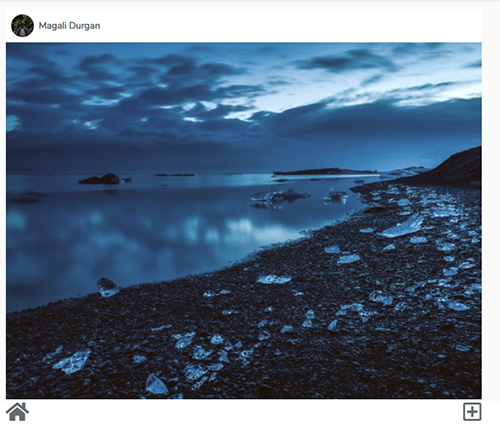

## Laragram





## About my use of this project

<a href="https://dev.to/ashleygraf101/learning-by-breaking-things-39ep">CI with Laravel/MySQL/Cypress using Github Actions</a>

Principles
- Fast-running tests (linter & unit) at the start
- Slow tests (e2e) at the end
- Test environment echoes production environment
- Don't change major elements of the production environment
- (Try things. See what breaks it)

## Installation

### Prerequisites

* To run this project, you must have PHP 7 installed.
* You should setup a host on your web server for your local domain.


### Step 1

 Begin by cloning this repository to your machine, and installing all Composer & NPM dependencies.

```bash
git clone https://github.com/lupanvi/laragram.git
cd laragram
touch .env
composer install && npm install
php artisan key:generate
	CREATE DATABASE forge;
	GRANT ALL on forge.* to forge@localhost;
php artisan migrate --seed
php artisan storage:link
npm run dev
```

### Step 2

Next, boot up a server and visit your laragram app. 

1. ```php artisan serve```
1. Visit: `http://your-laragram-url/login` and write the demo credentials:
	user: demo@gmail.com , password: 123456 , and press the login button
2. You will be redirected to the home page, where you can see and add pictures with filters

### Running tests

```
php artisan config:cache
php artisan config:clear
phpunit
```

### Todo

(See open pull request)
